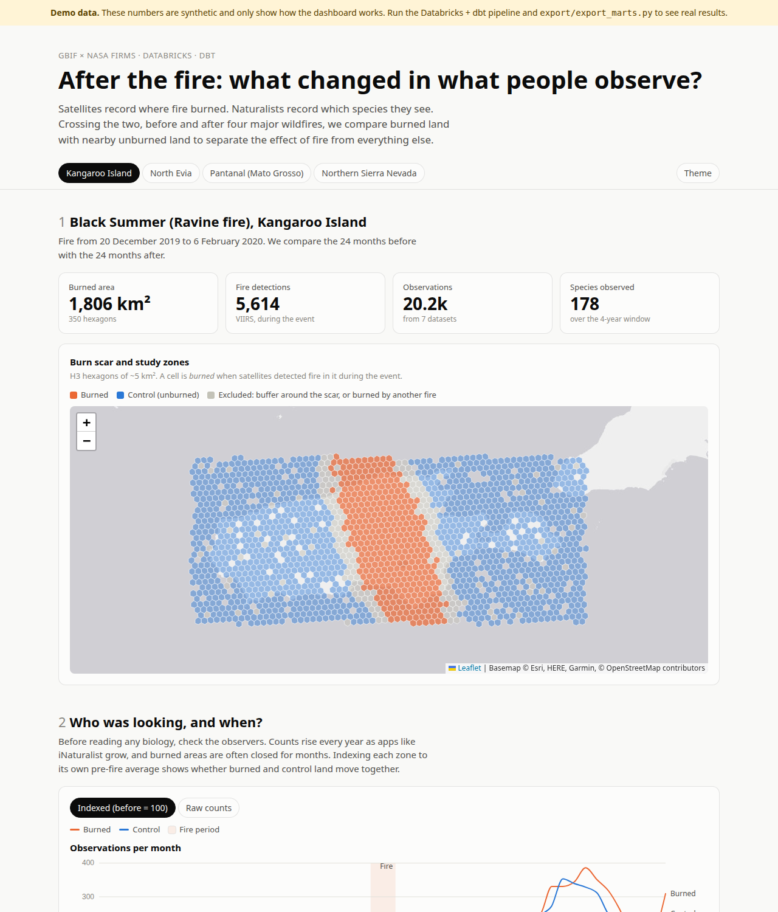

# After the Fire — wildfires × biodiversity observations

An end-to-end **Databricks + dbt** data platform combining global satellite wildfire detections
(NASA FIRMS) with biodiversity observations (GBIF), published as an interactive dashboard.

**Question:** after a major wildfire, does what naturalists observe in the burned area change —
beyond what changed everywhere else?

**[Live dashboard →](https://<your-github-username>.github.io/wild-life-diversity/)**



## Study regions and fire episodes

| Region | Fire episode | Dates |
|---|---|---|
| Kangaroo Island, AU | Black Summer (Ravine fire) | Dec 2019 – Feb 2020 |
| North Evia, GR | Evia wildfires | Aug 2021 |
| Pantanal, BR | Pantanal fires | Jul – Oct 2020 |
| Northern Sierra Nevada, US | Dixie Fire | Jul – Oct 2021 |
| Landes de Gascogne, FR | La Teste-de-Buch & Landiras fires | Jul – Sep 2022 |
| Landes de Gascogne, FR | Saumos & Biscarrosse fires (~45,000 ha) | Jul – Aug 2026 |

A **region** is a bounding box ([`dbt/seeds/regions.csv`](dbt/seeds/regions.csv)); a region can
hold several **fire episodes** ([`dbt/seeds/fire_episodes.csv`](dbt/seeds/fire_episodes.csv)).
Episodes of one region share the map — each burned cell takes the red of its most recent fire,
bright for the latest, dark for older ones — and each gets its own before/after analysis.
Adding a row adds a study.

For each episode: `before_months` before (24 by default, 60 for Gironde 2026) vs 24 months after.
For a recent fire the "after" window stops yesterday, and "before" is restricted to the same
season of the previous years (season matching), so that a summer is never compared with a whole year.

## Architecture

Everything runs in the cloud — no laptop involved once deployed.

```
                    Databricks job  (databricks.yml, monthly, serverless)
 GBIF API ────┐    ┌───────────────────────────────────────────────────────────┐
              ├──► │ ingest_gbif / ingest_firms ──► UC volume wildfire_raw.landing│
 NASA FIRMS ──┘    │                                  │                         │
                   │ dbt_build (SQL warehouse)        ▼                         │
                   │   bronze  read_files() — raw CSV, untyped                  │
                   │   silver  typed, H3-indexed, burn zones per fire episode   │
                   │   gold    BACI, species response, taxon mix, map cells     │
                   └───────────────────────────────────────────────────────────┘
                                                      │
 GitHub Actions ── export_marts.py ──► web/data/*.json ──► GitHub Pages (D3 + Leaflet)
```

| GitHub workflow | Does |
|---|---|
| `deploy-databricks.yml` | deploys the Databricks job (bundle) on every push to `main` |
| `deploy-pages.yml` | exports the gold tables and publishes the dashboard — on push and monthly |
| `dbt-ci.yml` | parses the dbt project on every pull request |

## Method

- **Spatial grid** — every observation and fire detection is indexed on an
  [H3](https://h3geo.org/) hexagon (resolution 7, ~5 km²) with Databricks' native H3 functions.
- **Zones** — *burned*: ≥ 2 nominal/high-confidence VIIRS detections during the fire;
  *buffer*: 2 rings around the scar (excluded, edge effects); *disturbed*: burned by another fire
  in the window (excluded); *control*: everything else in the region.
- **BACI design** (Before-After-Control-Impact) —
  `effect = (burned after / before) / (control after / before)`. Dividing by the control cancels
  region-wide changes such as the growth of iNaturalist.
- **Same sources before and after** — GBIF publishers upload with very different delays
  (iNaturalist weekly, eBird yearly, some national programmes years later). Comparisons only use
  datasets that already have records after the fire, so a late publisher cannot fake a decline.
- **Rarefied richness** — species counts grow with effort, so richness is compared at equal sample
  size (Hurlbert's expected species, `Σ 1 − (1 − nᵢ/N)ⁿ`).
- **Species response** — change in a species' *share* of observations, burned vs control, on a
  log2 scale with +0.5 smoothing.

**Reliability guard.** When one of the four BACI boxes has fewer than 100 observations, the
dashboard says "too early" instead of showing an effect — the case of the 2026 French fires, whose
burned pine forest is rarely visited and whose recent records are still reaching GBIF (eBird
publishes yearly).

**Limits.** GBIF is presence-only, opportunistic data: results describe *observations*, not
populations. Observer behaviour itself reacts to fire (closures, then curiosity visits).

## Data quality

37 dbt tests: uniqueness and nullability of keys, accepted values, referential integrity, and
two business rules (rarefied richness never exceeds observed richness; taxon shares sum to 100%).

## Run it

Setup guide (French): [docs/GUIDE_DEMARRAGE.md](docs/GUIDE_DEMARRAGE.md) · How the data is presented and why: [docs/GUIDE_PRESENTATION.md](docs/GUIDE_PRESENTATION.md).

**In the cloud (recommended)** — add the repository secrets `DATABRICKS_HOST`,
`DATABRICKS_HTTP_PATH`, `DATABRICKS_TOKEN`, store the NASA key in the Databricks secret
`wildfire/firms_map_key`, and push: GitHub deploys the job, Databricks refreshes the data on the
1st of each month, GitHub Pages republishes on the 2nd.

**On a laptop** (development):

```bash
pip install -r requirements.txt
python ingestion/gbif.py && python ingestion/firms.py      # 1. extract (active regions)
python databricks/upload_to_volume.py                       # 2. load
cd dbt && dbt deps && dbt seed && dbt build                 # 3. transform + test
python export/export_marts.py                               # 4. publish data
python -m http.server -d web 8000                           # 5. preview
```

`web/data/` holds the latest export, so step 5 alone serves the dashboard.

## Stack

Databricks Free Edition (Unity Catalog volumes, serverless jobs, Asset Bundles, SQL warehouse, H3) · dbt-databricks · Python ·
D3.js · Leaflet · h3-js · GitHub Actions / Pages

## Data sources & citation

- GBIF.org — occurrence data via the GBIF API. For publication, cite the datasets used; for large
  extractions prefer the GBIF Download API, which issues a citable DOI.
- NASA FIRMS — VIIRS S-NPP 375 m active fire product (standard processing), NASA LANCE/FIRMS.
# wild-life-diversity
